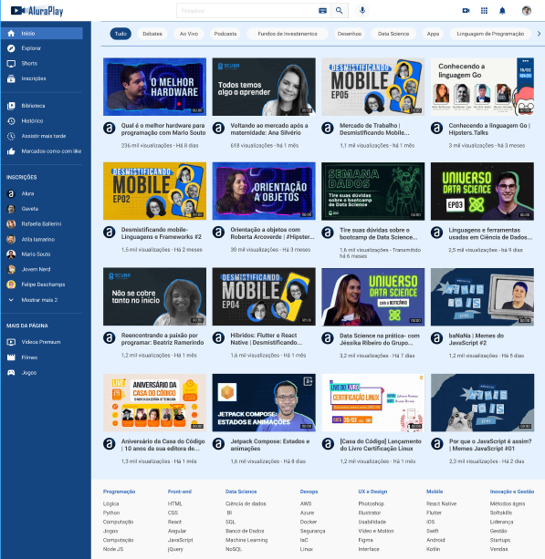

# AluraPlay

Este projeto foi desenvolvido durante o curso "Flexbox e layouts responsivos" da Alura, com o objetivo de aprender e aplicar conceitos de Flexbox na criação de layouts responsivos. Utilizamos o projeto "AluraPlay" como base para nossas práticas e implementações.

## Descrição

O AluraPlay é uma plataforma de vídeos inspirada no YouTube, onde aplicamos técnicas de Flexbox para criar um layout moderno e responsivo. Durante o curso, exploramos diferentes propriedades e valores do Flexbox para posicionar e alinhar elementos da interface, tornando-a adaptável a diferentes tamanhos de tela.



## Estrutura do Projeto

O projeto está organizado em arquivos HTML e CSS:

- `index.html`: Contém a estrutura HTML do projeto.
- `css/flexbox.css`: Contém os estilos aplicados utilizando Flexbox.
- `css/reset.css`: Reset de estilos para garantir consistência entre diferentes navegadores.
- `css/estilos.css`: Estilos gerais do projeto.

## Funcionalidades Implementadas

1. **Cabeçalho**: Utilizamos Flexbox para alinhar os itens do cabeçalho, incluindo a logo, barra de pesquisa e ícones de navegação.

    ```css
    .cabecalho__container {
        display: flex;
        justify-content: space-between;
        align-items: center;
        position: fixed;
        top: 0;
    }
    ```

2. **Menu Lateral**: O menu lateral é fixado na parte inferior da tela em dispositivos móveis e na lateral esquerda em telas maiores, utilizando Flexbox para alinhar os itens verticalmente.

    ```css
    .menu__container {
        position: fixed;
        bottom: 0%;
        height: 74px;
        width: 100%;
    }

    @media (min-width: 834px) {
        .menu__container {
            left: 0;
            height: auto;
            width: 74px;
            top: 80px;
        }
    }

    @media (min-width: 1440px) {
        .menu__container {
            width: 239px;
            overflow: scroll;
        }
    }
    ```

3. **Seção Superior**: A seção superior utiliza Flexbox para criar um carrossel de categorias que pode ser rolado horizontalmente.

    ```css
    .superior__secao__container {
        display: flex;
        align-items: center;
        white-space: nowrap;
        overflow: scroll;
        gap: 15px;
    }
    ```

4. **Vídeos**: Os vídeos são organizados em um layout de grade flexível, que se ajusta ao tamanho da tela e ao número de vídeos disponíveis.

    ```css
    .videos__container {
        display: flex;
        flex-wrap: wrap;
        gap: 10px;
    }

    .videos__item {
        height: 303px;
        width: 280px;
        flex-grow: 1;
    }
    ```

5. **Rodapé**: O rodapé é organizado em colunas utilizando Flexbox, adaptando-se ao layout da página conforme necessário.

    ```css
    .rodape__container {
        display: flex;
        flex-flow: column wrap;
    }

    @media (min-width: 834px) {
        .rodape__container {
            justify-content: space-between;
        }
    }
    ```

## Como Executar o Projeto

1. Clone este repositório para o seu ambiente local.
2. Navegue até o diretório do projeto.
3. Abra o arquivo `index.html` em seu navegador preferido.

## Tecnologias Utilizadas

- HTML5
- CSS3 (Flexbox)

## Autor

Este projeto foi desenvolvido por [Mayara](https://github.com/mayarakaren) durante o curso "Flexbox e layouts responsivos" da Alura em parceria com o programa ONE.

---
